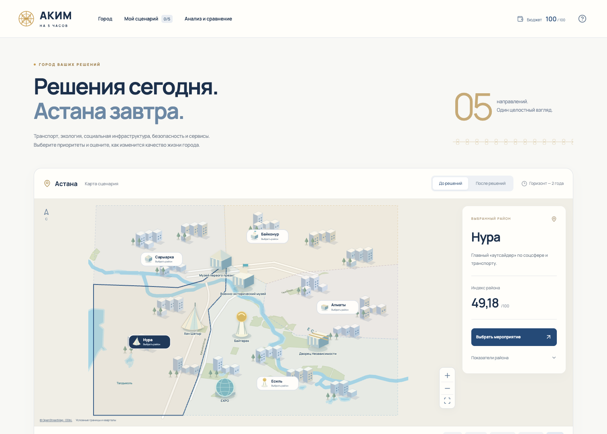
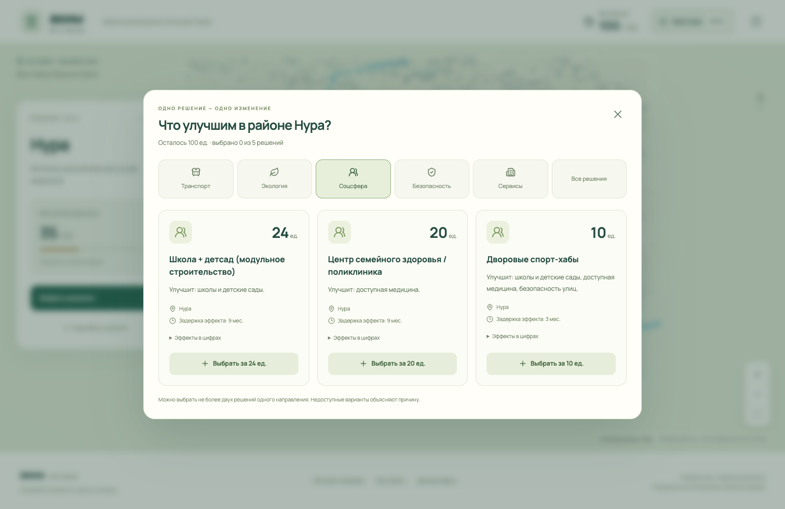
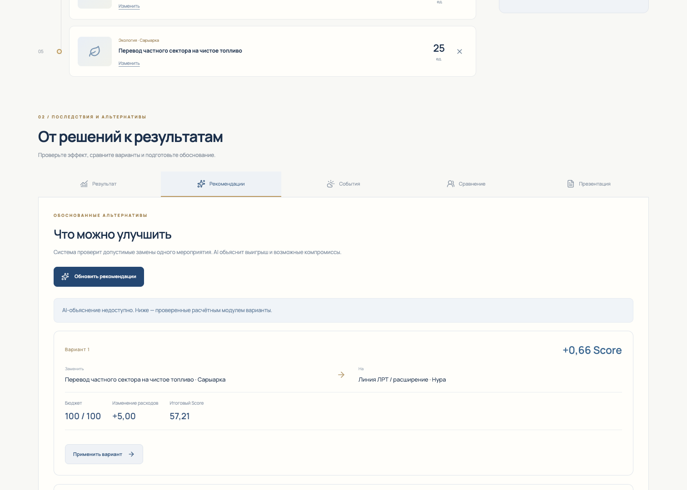
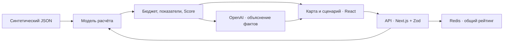

<p align="center">
  
</p>

<p align="center">
  <strong>Пять направлений. Один бюджет. Измеримые последствия для города.</strong><br />
  AI-симулятор городского управления · команда That Day 
</p>

<p align="center">
  <a href="https://akim-five-hours.vercel.app"><strong>Открыть демо ↗</strong></a> ·
  <a href="#быстрый-запуск">Запустить локально</a> ·
  <a href="docs/demo.md">Сценарий показа</a> ·
  <a href="docs/README.md">Документация</a> ·
  <a href="docs/repository.md">Карта веток</a>
</p>

---

## Город ваших решений

Построить школу, улучшить транспорт или обновить городские сети? «Аким на 5 часов» помогает увидеть, как выбор при ограниченном бюджете меняет качество жизни разных районов Астаны. Пользователь собирает сценарий на синтетических данных, получает **Astana Quality of Life Score** и объяснение сильных сторон, рисков и последствий от AI.

Проект предназначен для городских управленцев, аналитиков и участников симулятора: помогает сопоставить приоритеты транспорта, экологии, социальной инфраструктуры, безопасности и сервисов при ограниченном бюджете.

Интерфейс сочетает спокойную карту с объёмными ориентирами, сине-золотую палитру и казахский орнамент. В основе — правила городского планирования из датасета: стоимость, сроки эффекта, совместимость мероприятий и баланс между районами.

<p align="center">
  <a href="https://akim-five-hours.vercel.app"></a>
</p>

**100** единиц бюджета · **5** районов · **5** направлений · **14** мероприятий · **10** показателей · **8** кварталов моделирования

> [!NOTE]
> **Актуальная версия — [`main`](https://github.com/BAITC-Hacks/hack-e54d9694-that-day-in/tree/main).** Здесь находятся приложение, датасет, тесты и документация. Ветки `codex/*` сохраняют этапы разработки; для знакомства и запуска используйте `main`. [Назначение всех веток →](docs/repository.md)

## Возможности

| Обязательные требования | Реализация |
| :--- | :--- |
| Единый виртуальный бюджет | Каждый участник получает собственные 100 единиц на одинаковых условиях |
| Пять направлений решений | Транспорт, экология, социнфраструктура, безопасность и городские сервисы |
| Контроль превышения бюджета | Проверки при выборе, замене и удалении; повторная валидация на сервере |
| AI-анализ | Сервер передаёт модели проверенные расчёты; ответ имеет структурированный формат |
| Astana Quality of Life Score | Прозрачный детерминированный расчёт с учётом всех районов |
| Объяснение сценария | Сильные стороны, риски и последствия со ссылками на численные основания |

| Дополнительные функции | Что можно сделать |
| :--- | :--- |
| Сравнение участников | Опубликовать результат, увидеть общий рейтинг и личный рекорд |
| Изменения районов | Переключить карту «До / После», сравнить индексы и показатели |
| Рекомендации | Изучить проверенные замены мероприятий и применить подходящий вариант |
| Городские события | Выделить резерв, перераспределить бюджет и пересчитать отдельный план |
| Презентация | Просмотреть краткие слайды и скачать Markdown; экспорт PPTX/PDF пока отсутствует |

<details>
<summary><strong>Ещё экраны: выбор мероприятия, рекомендации и мобильная версия</strong></summary>

### Каталог решений



### Рекомендации



[Посмотреть мобильную версию →](docs/ui/mobile.png)

</details>

## Как работает решение

1. Приложение загружает заранее подготовленный синтетический датасет: районы, исходные показатели, стоимость и эффекты мероприятий.
2. Пользователь выбирает район на карте и собирает пять решений из каталога. Интерфейс показывает расходы и причины недопустимого выбора.
3. Сервер проверяет версию данных и весь сценарий, применяет эффекты на горизонте восьми кварталов и вычисляет Score.
4. Пользователь сравнивает «До / После». AI получает рассчитанные факты и возвращает объяснение сильных сторон, рисков и последствий.
5. По желанию пользователь применяет рекомендации, рассматривает отдельный сценарий события, публикует результат в рейтинге или формирует презентацию.

## Быстрый запуск

Нужны **Node.js 22** и npm. Репозиторий приватный: для клонирования необходим доступ команды к GitHub.

```sh
git clone https://github.com/BAITC-Hacks/hack-e54d9694-that-day-in.git
cd hack-e54d9694-that-day-in
git switch main
npm ci
npm run dev
```

Открыть **http://localhost:3000**. Без секретов доступны карта, бюджет, расчёт Score, городские события и численные варианты улучшений.

Для AI и общего рейтинга создайте `.env.local` по образцу `.env.example`, если такого файла ещё нет:

| Серверная переменная | Назначение |
| :--- | :--- |
| `OPENAI_API_KEY` | AI-анализ, объяснение рекомендаций и текст презентации |
| `OPENAI_MODEL` | Необязательный выбор модели; текущий вариант указан в `.env.example` |
| `UPSTASH_REDIS_REST_URL` + `UPSTASH_REDIS_REST_TOKEN` | Общее хранилище рейтинга |
| `PARTICIPANT_SECRET` | Подпись cookie участника; не менее 32 случайных символов |

Вместо Upstash-пары поддерживается `KV_REST_API_URL` + `KV_REST_API_TOKEN` от Vercel Marketplace. Пары не смешиваются. Секреты остаются на сервере; `.env.local` исключён из Git.

При недоступности AI расчёт сохраняется, а интерфейс сообщает об отсутствии объяснения. Доступны 6 расчётных/служебных слайдов вместо 9 с AI. Без Redis рейтинг показывает состояние недоступности с повторной загрузкой.

## Как считается результат

**Датасет — основа проекта:** [исходный JSON](dataset/dataset.json) и [описание данных](dataset/README.md). По его правилам выбираются ровно пять разных мероприятий, максимум два из одного направления, на сумму не более 100. Покрытие всех пяти направлений не обязательно. Учитываются районный/городской охват, задержки эффекта, синергии и несовместимости.

```text
Score = 0.7 × средний индекс города
      + 0.3 × индекс самого слабого района
      − количество критических значений
```

Средний индекс взвешен по долям населения; критическое значение — показатель строго ниже 40. AI объясняет готовые результаты, не назначая баллы. [Формула и детали модели →](docs/model.md)

Контрольный сценарий: расходы **95 / 100**, исходный Score **52,55768**, итог **56,54307**, критических значений после мер **0**. Его можно загрузить через значок помощи в приложении. [Демо по шагам →](docs/demo.md)

## Устройство проекта

| Слой | Технологии и ответственность |
| :--- | :--- |
| Интерфейс | Next.js 16, React 19, TypeScript; карта, выбор решений и визуализация |
| Контракты | Zod 4; единые схемы данных и ответов API |
| Расчёты | Общий модуль TypeScript; исходный JSON и серверная проверка |
| AI | OpenAI SDK 6, Responses API + Structured Outputs; модель по умолчанию `gpt-5.4-mini-2026-03-17`, настраивается через `OPENAI_MODEL` |
| Хранение | Черновик/отчёты — локально в браузере; общий рейтинг — Redis |
| Проверки | Vitest, Playwright, TypeScript, ESLint |
| Публикация | Vercel, Node.js 22; текущий деплой через CLI |



Клиент отправляет ID выбранных мер и районов, а не цены и готовый Score. Сервер пересчитывает результат из собственного каталога. Ключи AI/Redis не передаются браузеру. Общая модель также позволяет показывать предварительные изменения в интерфейсе.

```text
dataset/          Исходные синтетические данные и правила
src/app/          Страница приложения и API
src/components/   Карта, сценарий, AI-отчёт и дополнительные вкладки
src/features/     Клиентское состояние, запросы и география
src/shared/       Контракты; отдельно помеченные тестовые примеры
src/lib/          Симуляция, AI, рейтинг и экспериментальная проекция отзывов
public/maps/      Упрощённая карта и исходная география
scripts/          Воспроизводимая сборка карты
tests/            Unit/API, браузерные сценарии и ручные HTTP-проверки
docs/             Модель, интеграция, демо, публикация и карта веток
```

## Проверки и воспроизводимость

```sh
npm run typecheck
npm run lint
npm test
npx playwright install chromium
npm run test:e2e
npm run build
```

Зафиксировано **131 unit/API-тест и 14 браузерных сценариев** на интегрированной версии от 23.09.2026. Автотесты не расходуют AI-токены: симуляция и события проверяются через настоящий сервер, AI и Redis подменяются только на границе запросов в браузерных тестах. Результаты настоящих проверок AI/Redis и код опубликованной сборки указаны в [журнале публикации](docs/deployment.md).

Сборка для production: `npm run build`, затем `npm run start`. HTTP smoke и отдельные платные live-проверки описаны в [демо и проверках](docs/demo.md#проверки-перед-показом).

## Команда и работа с репозиторием

| Участник | Область ответственности |
| :--- | :--- |
| [@altynbk](https://github.com/altynbk) · разработчик 1 | Интерфейс, карта, клиентская интеграция, браузерные тесты и оформление проекта |
| [@re1nhardd](https://github.com/re1nhardd) · разработчик 2 | Датасет/контракты, модель расчёта, AI, API и серверные тесты |

[Правила совместной работы](CONTRIBUTING.md) · [Ветки и PR](docs/repository.md) · [Вся документация](docs/README.md)

## Данные и интеграции

Синтетический `dataset/dataset.json` хранится в репозитории и не содержит персональных данных. Карта строится из сохранённого снимка OpenStreetMap и иллюстративных объектов; внешний картографический API при работе приложения не требуется. OpenAI используется для текстовых объяснений, Redis — для рейтинга, Vercel — для размещения. NVIDIA API в текущей реализации не используется.

## Статус и ограничения

- Новый интерфейс и дополнительные вкладки опубликованы на [демо-сайте](https://akim-five-hours.vercel.app). Push в GitHub сам по себе не обновляет Vercel: автодеплой ещё не подключён.
- Данные синтетические. Пять зон карты соответствуют датасету; границы и кварталы иллюстративны. Это учебный симулятор, а не официальный прогноз развития города.
- Рейтинг различает браузерных участников, а не подтверждённые аккаунты. Рекомендации ищут улучшение заменой одного мероприятия и не гарантируют глобальный оптимум.
- Экспериментальный API обработки отзывов сохранён отдельно; пользовательский экран этого режима не входит в текущую версию.
- География: © OpenStreetMap contributors, ODbL. [Источники и атрибуция →](docs/map.md). Референс композиции — [Visit Astana](https://visitastana.kz/en/map/). Лицензия на исходный код проекта пока не выбрана командой.

---

<p align="center"><strong>АСТАНА. ГОРОД РЕШЕНИЙ.</strong><br /><sub>Хакатонный проект · That Day In · 2026</sub></p>
